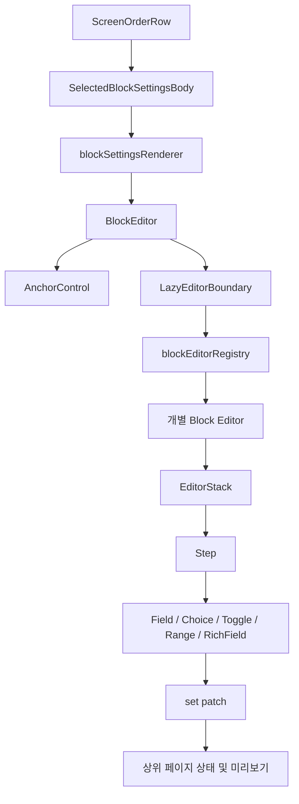

# Pagero 블록 편집기 UX/UI 통합 명세

> **2026-07-13 개정 안내**
> 화면 순서 행의 직접 조작, 재클릭 닫기, 평평한 탭/구분선 UI는 `docs/editor-block-editor-modernization-v2.md`를 최우선 구현 기준으로 사용한다. 이 문서와 v2가 충돌하면 v2를 따른다.
- 문서 상태: 구현 기준안
- 작성일: 2026-07-12
- 기준 브랜치: `integrate/pagero-internal-page-split-safe`
- 기준 커밋: `5c34d0b`
- 최우선 목표: 데스크톱 블록 편집기 내부의 정보 구조, 입력 방식, 상태 표현을 하나의 제품 언어로 통일한다.

## 구현 진행 현황

2026-07-13 기준:

| 영역 | 상태 | 비고 |
|---|---|---|
| 공통 `BlockEditorShell` | 완료 | 일반 블록 편집기 공통 헤더와 상태 안내 |
| `EditorSection`, `EditorField` | 완료 | 내용·디자인·고급 설정 구조와 입력 상태 |
| `SegmentedControl`, `ToggleRow` | 완료 | 신규 블록 전환에 사용 |
| `EditorList` | 완료 | 한 항목 펼침, 새 항목 자동 열기, 추가·삭제·빈 상태 |
| Text | 완료 | 내용과 고급 설정 분리 |
| Hero | 완료 | 내용과 이미지 디자인 분리 |
| Image | 완료 | 이미지·캡션·표시 방식 분리, 갤러리 항목 공통 목록 적용 |
| Cards | 완료 | 공통 반복 목록 적용 |
| FAQ | 완료 | 공통 반복 목록 적용 |
| Links | 완료 | 공통 반복 목록 적용 |
| Download, TopNav, BottomBar | 완료 | 공통 섹션 및 고정 블록 shell 적용 |
| Form, Reservation | 완료 | 기존 hook 유지, 질문·선택지·예약 추가 필드 공통 행 구조 적용 |
| Map, Schedule, Search, Activity | 완료 | 내용과 표시 방식 분리 |
| Timer, Footer, Spacer, Divider, Code | 완료 | 공통 섹션 UI와 고급 동작 분리, 기존 데이터 계약 유지 |
| 모바일 접수함·통계 전용 처리 | 완료 | 접수함·통계만 허용, 편집·스타일·설정·템플릿·미리보기 미마운트 |

현재 검증:

- `npm run mojibake:qa`: 통과, 685개 파일·6개 검사
- `npm run runtime:qa`: 통과, 519개 파일·1,609개 검사
- `npm run rendering:qa`: 통과, 163개 렌더링·19개 시각 기하·6개 뷰포트 계약
- `npm run build`: 통과, 2,150개 모듈·블록 편집기 lazy chunk 20개
- CSS 예산: 393,801 / 430,000 bytes(91.6%), FormEditor 설정·외부 코드·HTML 모달 CSS를 6.07 kB lazy 청크로 분리 완료
- 보호 파일 diff: 없음
- 데스크톱 편집기 브라우저 QA: 로컬 합성 인증 상태에서 기본 편집기와 Form 편집기 통과; 실제 서버 로그인 상태 확인은 운영 전 잔여
- 모바일 운영 브라우저 QA: 390×844에서 접수함·통계만 노출, 편집 관련 패널 미마운트, 2열 탭·활성 상태·가로 오버플로 검증 통과
- `integration:qa`: 통과, SettingsPanel 분리 경계·lazy editor 복구·화면 순서 직접 조작 계약 포함
- `css:qa`: 통과, 112개 활성 CSS·536,617 / 550,000 bytes; frozen public home은 별도 예산으로 감시

내부 편집기 검증 실패를 공개 홈, route, runtime router, functions, server 또는 `base-public*.css` 변경으로 우회하지 않는다.

## 1. 문서 목적

이 문서는 Pagero 워크스페이스에서 화면 블록을 선택했을 때 열리는 편집기 내부 UX/UI를 개편하기 위한 구현 명세다.

이번 개편의 핵심은 바깥 탭이나 헤더를 예쁘게 만드는 것이 아니다. 사용자가 `히어로`, `텍스트`, `이미지`, `카드`, `상담 폼`, `예약` 등 어떤 블록을 열더라도 같은 방식으로 이해하고 편집할 수 있게 만드는 것이 우선이다.

작업자는 이 문서를 기준으로 다음을 판단한다.

1. 어떤 공통 컴포넌트를 먼저 만들어야 하는가.
2. 기존 블록별 옵션을 `내용`, `디자인`, `동작`, `고급 설정` 중 어디에 배치해야 하는가.
3. 어떤 조작은 즉시 반영하고 어떤 조작은 확인이 필요한가.
4. 데스크톱에서 편집기를 어떻게 열고 닫으며 현재 위치를 유지해야 하는가.
5. 기존 저장, 미리보기, 블록 모델을 깨뜨리지 않고 어떻게 단계적으로 교체할 것인가.

## 2. 최우선 결정

### 2.1 우선순위

구현 우선순위는 아래와 같다.

1. 블록 편집기 내부 공통 골격
2. 공통 입력 컨트롤과 상태 표현
3. 핵심 블록의 정보 구조
4. 반복 항목 편집 UX
5. 오류, 로딩, 빈 상태
6. 화면 순서 목록과 외부 탭의 시각 정리

상단 탭, 워크스페이스 헤더, 페이지 전역 레이아웃 개선은 블록 편집기 내부 통일이 끝난 뒤 진행한다.

### 2.2 유지할 기존 동작

- `BlockEditor`가 블록 타입에 맞는 lazy editor를 선택하는 구조를 유지한다.
- 각 편집기가 `s`를 읽고 `set(patch)`로 블록 설정을 즉시 갱신하는 계약을 유지한다.
- 페이지 저장은 상위 워크스페이스 저장 흐름이 담당한다.
- 편집 중 변경은 기존 미리보기에 즉시 반영한다.
- lazy import와 블록별 chunk 분리를 유지한다.
- 블록 데이터 스키마와 공개 랜딩 렌더링 계약은 이번 UI 개편에서 임의 변경하지 않는다.

### 2.3 이번 단계에서 하지 않는 일

- 운영 루트 `/` 또는 frozen C63 메인 변경
- 공개 랜딩 렌더러 재설계
- 라우팅 구조 변경
- 블록 데이터 모델 전면 교체
- 저장 API 또는 서버 저장 방식 변경
- 새로운 블록 타입 추가
- 전체 CSS를 한 번에 삭제하거나 재작성
- 모든 편집기를 동시에 교체하는 빅뱅 패치
- 모바일 블록 편집 기능
- 모바일 스타일 및 페이지 설정 기능
- 모바일 미리보기와 블록 추가·삭제·순서 변경 기능

## 3. 보호 영역

아래 영역은 편집기 내부 UX/UI 개편의 직접 수정 대상이 아니다.

- `index.html`
- `src/main.jsx`
- `src/App.jsx`의 홈, 루트, 공개 라우팅
- `src/routes/*`
- `src/runtime/AppRuntimeRouter.jsx`
- `src/runtime/AppRouteScreens.jsx`
- `src/runtime/lazySurfaces.jsx`
- `src/screens/PageroCanonicalHome.jsx`
- `src/screens/PublicHomeRoute.jsx`
- `src/screens/WayziStaticPages.jsx`
- `src/screens/PageroExactHome.jsx`
- `src/screens/PageroRestoredHome.jsx`
- `src/styles/base-public*.css`
- `functions/frozenHome.js`
- `functions/index.js`의 루트 및 홈 처리
- `server/index.mjs`의 루트 및 홈 처리
- `src/preview/LandingRenderer.jsx`
- `src/preview/LandingRenderer.css`

공개 미리보기 반영 문제가 발견되더라도 위 파일을 자동 수정하지 않는다. 먼저 문제와 필요한 계약 변경을 보고한다.

## 4. 현재 코드 구조

현재 편집기 렌더링 흐름은 다음과 같다.



### 4.1 공통 진입점

- `src/editor/BlockEditor.jsx`
  - `block.type`으로 편집기를 선택한다.
  - `s`, `set`, `page`, `blockId`, `blockType`과 의존성을 전달한다.
  - 현재 `AnchorControl`이 모든 블록 편집기보다 먼저 노출된다.
- `src/editor/blockEditorRegistry.jsx`
  - 20개 블록 타입과 lazy editor를 연결한다.
- `src/editor/LazyEditorBoundary.jsx`
  - 블록 editor chunk 로딩 오류를 해당 블록 범위에서 처리한다.
- `src/editor/editPanelParts/ScreenOrderRow.jsx`
  - 선택된 블록 아래에 인라인 편집기를 연다.
- `src/editor/editPanelParts/SelectedBlockSettingsBody.jsx`
  - 실제 block editor를 렌더링한다.

### 4.2 기존 공통 컨트롤

- `EditorStack`: 섹션 묶음
- `Step`: 접을 수 있는 섹션
- `Field`: 단일 input 또는 textarea
- `RichField`: HTML 값을 일반 텍스트 textarea로 편집
- `Choice`: 선택 버튼 그룹
- `Toggle`: 이진 설정
- `Range`: 숫자 범위
- `Color`: 색상 입력
- `ImageInput`: 이미지 선택
- `MiniDetail`: 반복 항목의 접이식 상세

기존 부품을 모두 버리지 않는다. 이름, API, 접근성, 상태 표현을 정리하여 점진적으로 교체한다.

## 5. 현재 문제 진단

### 5.1 편집기마다 정보 구조가 다르다

예시:

- `TextEditor`는 하나의 `Step`에 제목과 설명만 넣는다.
- `HeroEditor`는 기본 정보와 이미지를 별도 컴포넌트로 나누지만 사용자에게 섹션 체계가 명확하지 않다.
- `ImageEditor`는 이미지, 갤러리 표시, 캡션 순서가 기능 단위로만 나뉜다.
- `CardsEditor`는 블록 기본 정보와 반복 카드 항목을 같은 깊이에 둔다.
- `FormEditor`는 기본 정보, 질문, 외부 공유 기능이 같은 중요도로 노출된다.
- `ReservationEditor`는 기본 정보, 시간, 추가 필드가 있지만 일반 사용자와 고급 설정의 구분이 없다.

결과적으로 사용자는 블록을 바꿀 때마다 편집 방법을 다시 학습해야 한다.

### 5.2 기술 정보가 사용자 정보보다 먼저 보인다

- `AnchorControl`이 모든 편집기 상단에 먼저 렌더링된다.
- 위젯 코드, 앵커, 외부 HTML, 내부 대상 정보가 기본 편집 흐름과 섞일 수 있다.
- 초보자는 페이지 문구를 바꾸기 전에 개발자용 개념을 보게 된다.

원칙: 앵커, 위젯 코드, 외부 HTML, 추적 및 내부 ID는 `고급 설정`으로 이동한다.

### 5.3 스타일 책임이 여러 파일에 중복되어 있다

현재 편집기 스타일은 다음 파일들에 걸쳐 중첩된다.

- `src/styles/service-polish.css`
- `src/styles/editor-blocks.css`
- `src/styles/editor-animation.css`
- `src/styles/editor-panel-cleanup.css`
- `src/styles/editor-final-clean.css`
- `src/styles/editor-screen-order-polish.css`
- `src/styles/preview-workspace-*.css`

동일한 `.field`, `.choice`, `.step`, `.block-editor` 선택자가 여러 파일에서 반복되고 `!important`로 덮인다. 블록별 보정 CSS도 공통 컨트롤을 다시 덮기 때문에 화면마다 밀도와 크기가 달라진다.

원칙: 신규 편집기 UI는 하나의 명시적인 루트 클래스 아래에서 스타일을 소유하고, 기존 전역 선택자와 충돌하지 않게 한다.

### 5.4 텍스트 인코딩 위험이 실제 코드에 존재한다

현재 확인된 예:

- `src/editor/FieldControl.jsx`의 라벨 분류 정규식 일부가 깨진 문자로 보인다.
- `src/editor/blockEditors/TextEditor.jsx`의 섹션 제목과 필드 라벨 일부가 깨진 문자로 보인다.

구현 작업자는 UI 개편 전에 해당 파일의 실제 UTF-8 상태를 확인해야 한다. PowerShell 기본 인코딩으로 한국어 파일을 일괄 재작성하지 않는다. 모든 단계에서 `npm run mojibake:qa`를 실행한다.

## 6. 사용자 목표와 핵심 작업 흐름

### 6.1 초보 사용자의 기본 목표

사용자는 다음 네 단계를 설명 없이 수행할 수 있어야 한다.

1. 수정할 블록을 선택한다.
2. 가장 중요한 내용을 바꾼다.
3. 미리보기에서 결과를 확인한다.
4. 페이지 저장 상태를 확인한다.

### 6.2 표준 편집 흐름

```text
화면 순서에서 블록 선택
→ 해당 위치에 편집기 열림
→ 첫 번째 핵심 입력으로 이동
→ 값 변경 즉시 미리보기 반영
→ 상위 저장 상태가 변경됨
→ 다른 블록 선택 또는 편집기 닫기
→ 기존 목록 위치 유지
```

### 6.3 사용자가 항상 알아야 하는 상태

- 지금 어떤 블록을 편집 중인지
- 해당 블록이 페이지에 표시되는지
- 어떤 값이 필수인지
- 변경이 미리보기에 반영됐는지
- 페이지가 서버에 저장됐는지
- 오류가 발생했을 때 입력 내용이 보존되는지

## 7. 목표 편집기 정보 구조

모든 블록은 아래 순서를 기본값으로 사용한다.

```text
편집기 헤더
1. 내용
2. 디자인
3. 동작
4. 고급 설정
편집기 보조 상태
```

블록에 해당 옵션이 없으면 빈 섹션을 만들지 않는다. 그러나 존재하는 섹션의 순서는 바꾸지 않는다.

### 7.1 편집기 헤더

필수 요소:

- 블록 타입 아이콘
- 사용자용 블록 이름
- `편집 중` 상태
- 표시 여부 토글
- 닫기 버튼

선택 요소:

- 블록 사용자 지정 이름
- 오류 상태 배지

금지 요소:

- 삭제 버튼 직접 노출
- 내부 block ID 노출
- 위젯 코드 노출
- 별도 저장 완료처럼 오해할 수 있는 가짜 `적용 완료` 상태

### 7.2 내용 섹션

블록 목적을 결정하는 핵심 데이터를 배치한다.

- 제목
- 설명
- 본문
- 이미지
- 버튼 문구
- 질문
- 장소
- 날짜 및 시간

규칙:

- 처음 열었을 때 기본적으로 펼쳐진다.
- 가장 중요한 입력을 첫 번째에 둔다.
- 필수 필드는 라벨 옆에 `필수` 배지를 표시한다.
- placeholder는 예시보다 입력 목적을 설명한다.
- 라벨만으로 충분하면 중복 설명을 쓰지 않는다.

### 7.3 디자인 섹션

표현에만 영향을 주는 옵션을 배치한다.

- 정렬
- 크기
- 색상
- 배경
- 모서리
- 비율
- 간격
- 표시 방식

규칙:

- 기본적으로 접혀 있어도 된다.
- 초보자용 의미 선택을 먼저 제공한다.
- 픽셀 숫자는 고급 설정에서만 제공한다.
- 색상은 텍스트 입력보다 스와치와 선택 상태를 우선한다.

### 7.4 동작 섹션

사용자 클릭 또는 제출 이후 동작을 배치한다.

- 링크 대상
- 전화 연결
- 문자 연결
- 폼 제출
- 예약 완료
- 새 창 열기
- 노출 조건
- 타이머 종료 동작

규칙:

- 먼저 동작 방식을 고르고, 선택한 방식에 필요한 필드만 노출한다.
- 숨겨진 모드의 이전 값은 데이터에서 즉시 삭제하지 않는다.
- 현재 선택 모드와 맞지 않는 입력은 화면에서 감춘다.

### 7.5 고급 설정

다음 항목은 기본적으로 접힌다.

- 앵커 ID
- 위젯 코드
- 외부 HTML 생성
- 사용자 코드
- 세부 픽셀 값
- 내부 식별자
- 추적 관련 옵션
- 저장소 사용량 및 기술 정보

고급 설정을 열어도 위험 작업은 별도 구역으로 분리한다.

## 8. 공통 컴포넌트 명세

신규 공통 컴포넌트는 `src/editor/ui/` 또는 현재 코드 규칙과 합의된 동일 수준의 전용 디렉터리에 둔다. 구현 전에 최종 경로를 한 번 결정하고 블록별로 다른 위치에 중복 생성하지 않는다.

### 8.1 `BlockEditorShell`

책임:

- 편집기 헤더
- 섹션 순서
- 블록 표시 상태
- 편집기 닫기
- 오류와 로딩 영역

권장 API:

```jsx
<BlockEditorShell
  blockId={block.id}
  blockType={block.type}
  title={meta.label}
  icon={meta.icon}
  visible={block.visible}
  onVisibleChange={onToggleVisible}
  onClose={onClose}
  status="ready"
>
  {children}
</BlockEditorShell>
```

상태 값:

- `loading`
- `ready`
- `recovering`
- `error`

`BlockEditorShell`은 페이지 저장을 직접 수행하지 않는다.

### 8.2 `EditorSection`

기존 `Step`의 후속 공통 계약이다.

권장 API:

```jsx
<EditorSection
  id="content"
  title="내용"
  description="방문자에게 표시할 문구를 입력합니다."
  icon={FileText}
  defaultOpen
  tone="default"
>
  {children}
</EditorSection>
```

규칙:

- `id`는 `content`, `design`, `behavior`, `advanced` 중 하나를 우선 사용한다.
- 숫자 아이콘 `1`, `2`, `3`을 기본 UI로 사용하지 않는다.
- 펼침 상태는 `aria-expanded`로 노출한다.
- 제목 행 전체가 클릭 가능해야 한다.
- 열림 상태에서만 본문을 렌더링할지는 블록 성능 요구에 따라 결정하되 입력값을 잃지 않아야 한다.

### 8.3 `EditorField`

기존 `Field`와 `RichField`의 시각적 계약을 통일한다.

권장 API:

```jsx
<EditorField
  label="제목"
  description="페이지에서 가장 크게 보이는 문구입니다."
  required
  error={errors.title}
>
  <input value={title} onChange={...} />
</EditorField>
```

규칙:

- 라벨 분류를 한국어 정규식으로 추론하지 않는다.
- `kind="title"` 같은 의미가 필요하면 호출자가 명시한다.
- 라벨, 설명, 입력, 오류의 순서를 고정한다.
- input과 textarea의 focus, disabled, invalid 상태를 공통화한다.
- textarea는 콘텐츠 종류에 따라 최소 높이를 명시한다.

### 8.4 `SegmentedControl`

기존 `Choice`의 후속 계약이다.

사용 대상:

- 정렬
- 크기
- 표시 방식
- 링크 방식
- 레이아웃 모드

규칙:

- 2~4개 옵션에 사용한다.
- 선택 항목은 색상뿐 아니라 `aria-pressed`로 표시한다.
- 아이콘만 사용할 때 tooltip 또는 접근 가능한 이름을 제공한다.
- 5개 이상 옵션은 select 또는 menu를 검토한다.

### 8.5 `ToggleRow`

기존 `Toggle`의 후속 계약이다.

구조:

```text
설정 이름                         [토글]
설정이 실제 화면에 미치는 영향
```

규칙:

- 토글 자체에 `켜기`, `끄기` 텍스트를 반복하지 않는다.
- disabled 이유를 설명한다.
- 토글 값 변경은 즉시 반영한다.
- 위험하거나 데이터가 사라지는 변경에 토글을 사용하지 않는다.

### 8.6 `EditorList`

카드, FAQ, 링크, 다운로드, 폼 질문, 예약 추가 필드, 상단 메뉴 항목에 사용한다.

필수 기능:

- 항목 요약
- 펼치기/접기
- 드래그 순서 변경
- 키보드 이동 대안
- 복제
- 삭제
- 항목 추가
- 빈 상태

규칙:

- 한 번에 하나의 항목만 펼치는 것을 기본값으로 한다.
- 삭제 버튼은 펼친 항목 안 또는 더보기 메뉴에 둔다.
- 새 항목 추가 후 새 항목을 자동으로 열고 첫 필드에 초점을 준다.
- 항목 접기 후 목록 스크롤 위치를 유지한다.

### 8.7 `AdvancedDisclosure`

앵커, 코드, 외부 공유 등 고급 기능을 묶는다.

규칙:

- 기본적으로 닫힌다.
- 열기 전에는 기술 용어를 화면에 반복하지 않는다.
- 위험 기능이 있으면 별도 설명과 확인 절차를 제공한다.
- 일반 사용자 입력과 같은 카드 안에 중첩 카드로 만들지 않는다.

### 8.8 `EditorErrorState`

편집기 chunk 또는 렌더링 오류를 블록 범위에서 처리한다.

필수 문구:

```text
편집기를 불러오지 못했습니다.
입력한 페이지 내용은 유지되어 있습니다.
```

필수 동작:

- `다시 불러오기`
- 반복 실패 시 상세 오류 복사
- 페이지 전체를 막지 않음
- 다른 블록은 계속 편집 가능

사용자에게 asset hash, chunk 파일명, JavaScript 식별자 오류를 기본 노출하지 않는다.

## 9. 저장 및 반영 계약

### 9.1 상태 구분

Pagero 편집기에는 두 종류의 상태가 있다.

1. 로컬 페이지 모델 반영
2. 서버 저장

`set(patch)` 호출은 로컬 페이지 모델을 즉시 변경하고 미리보기에 반영한다. 이것을 서버 저장 완료로 표현하면 안 된다.

### 9.2 UI 문구

- 로컬 변경 발생: 상위 헤더 `저장되지 않은 변경`
- 서버 저장 중: `저장 중...`
- 서버 저장 성공: `저장됨`
- 서버 저장 실패: `저장 실패 · 다시 저장`

개별 블록 편집기 안에 무조건 `적용` 버튼을 추가하지 않는다. 기존 즉시 반영 계약과 충돌하기 때문이다.

### 9.3 별도 확인이 필요한 작업

아래 작업만 임시 draft와 명시적 확인을 허용한다.

- 이미지 자르기
- 사용자 코드 편집
- 외부 HTML 생성 옵션
- 여러 항목 일괄 편집
- 데이터 손실 가능성이 있는 형식 전환

확인 버튼 문구는 `적용`보다 구체적으로 작성한다.

- `자르기 적용`
- `코드 저장`
- `항목 변경 적용`

## 10. 블록별 화면 명세

### 10.1 `text`

내용:

- 제목
- 본문

디자인:

- 텍스트 정렬
- 제목 크기
- 본문 크기
- 글자색
- 배경색
- 상하 여백

고급:

- 앵커 ID

기본 포커스: 제목. 제목이 비어 있고 본문이 있으면 본문.

### 10.2 `hero`

내용:

- 제목
- 설명
- 대표 이미지

디자인:

- 텍스트 정렬
- 콘텐츠 위치
- 높이
- 이미지 표시 방식
- 이미지 밝기 또는 오버레이

동작:

- 주요 버튼 사용 여부
- 버튼 문구
- 버튼 대상

고급:

- 앵커 ID
- 세부 높이 값

### 10.3 `image`

내용:

- 실제 이미지 미리보기
- 이미지 선택 또는 교체
- 캡션
- 대체 텍스트

디자인:

- 맞춤 또는 채우기
- 비율
- 모서리
- 갤러리 표시 방식

동작:

- 클릭 대상

고급:

- 이미지 저장소 정보
- 앵커 ID
- 이미지 정리 기능

### 10.4 `cards`

내용:

- 섹션 제목
- 섹션 설명
- 카드 목록

디자인:

- 1열 또는 2열
- 카드 간격
- 카드 강조 스타일

카드 항목:

- 라벨
- 제목
- 본문
- 이미지 또는 아이콘
- 동작 대상

규칙: 카드 전체 설정과 개별 카드 설정을 시각적으로 분리한다.

### 10.5 `links`

내용:

- 섹션 제목
- 링크 목록

링크 항목:

- 이름
- 아이콘 또는 썸네일
- 대상 방식
- 대상 값

디자인:

- 목록 또는 버튼형
- 정렬
- 간격

### 10.6 `form`

내용:

- 폼 제목
- 안내 문구
- 제출 버튼 문구
- 질문 목록

동작:

- 제출 성공 제목
- 제출 성공 메시지
- 개인정보 동의

고급:

- 외부 공유
- 독립 HTML 생성
- 내부 form ID

규칙: 외부 공유는 기본 섹션과 같은 깊이에 노출하지 않는다.

### 10.7 `reservation`

내용:

- 예약 제목
- 안내 문구
- 완료 문구
- 고정 입력 항목
- 추가 입력 항목

동작:

- 예약 가능 요일
- 예약 가능 시간
- 중복 또는 제한 정책이 UI에 존재하는 경우 해당 설명

고급:

- 내부 연결 설정
- 앵커 ID

### 10.8 `faq`

내용:

- 섹션 제목
- 질문과 답변 목록

디자인:

- 첫 항목 기본 열림 여부
- 구분선 또는 카드형 표시

항목 추가 후 질문 필드에 초점을 준다.

### 10.9 `map`

내용:

- 장소명
- 주소
- 상세 주소
- 전화번호
- 주차 안내

디자인:

- 지도 높이
- 확대 수준
- 정보 표시 방식

동작:

- 지도 앱 열기
- 전화 연결

### 10.10 `schedule`

내용:

- 일정 제목
- 날짜
- 시간
- 장소
- 설명

동작:

- 캘린더 추가 또는 관련 동작이 실제 지원될 때만 노출

### 10.11 `timer`

내용:

- 타이머 제목
- 종료 시각
- 종료 문구

디자인:

- 표시 형식
- 강조 방식

동작:

- 종료 후 CTA
- CTA 대상
- 플로팅 CTA

### 10.12 `activity`

내용:

- 제목
- 데이터 출처 또는 표시 대상

디자인:

- 숫자 표시 방식
- 목록 표시 방식

고급:

- 데이터 갱신 및 기술 설정

### 10.13 `download`

내용:

- 다운로드 항목 목록
- 항목별 문구
- 설명
- 파일

동작:

- 다운로드 또는 외부 링크 방식

고급:

- 저장소 사용량
- 파일 정리

### 10.14 `search`

내용:

- 검색 안내 문구
- placeholder

디자인:

- 입력창 스타일
- 결과 표시 방식

동작:

- 검색 대상 범위

### 10.15 `topnav`

내용:

- 로고 또는 페이지명
- 메뉴 항목 목록

디자인:

- 정렬
- 배경
- 고정 여부

동작:

- 메뉴별 대상

규칙: 고정 블록이지만 일반 반복 항목 편집 패턴을 그대로 사용한다.

### 10.16 `bottombar`

내용:

- 버튼 개수
- 버튼별 문구와 아이콘

디자인:

- 배치
- 강조 버튼

동작:

- 버튼별 대상
- 타이머 표시

### 10.17 `footer`

내용:

- 상호명
- 대표자
- 연락처
- 이메일
- 주소
- 사업자번호

동작:

- 개인정보처리방침 링크
- 이용약관 링크

규칙: 사업자 정보, 연락처, 법적 링크를 별도 하위 그룹으로 구분한다.

### 10.18 `spacer`

디자인:

- 작게
- 보통
- 크게

고급:

- 직접 높이 값

숫자 입력만 단독으로 노출하지 않는다.

### 10.19 `divider`

디자인:

- 선 종류
- 두께
- 색상
- 상하 여백

### 10.20 `code`

내용:

- 사용자 코드

고급 및 안전:

- 코드 실행 영향 안내
- 코드 편집 모달
- 명시적 저장 또는 적용
- 오류 메시지

코드 블록은 일반 콘텐츠 블록과 다른 위험도를 가진다. 기본 화면에서 코드 전체를 펼치지 않는다.

## 11. 반복 항목 편집 계약

적용 대상:

- 카드
- FAQ
- 링크
- 다운로드
- 폼 질문
- 예약 추가 필드
- 상단 메뉴
- 하단 버튼

### 11.1 항목 요약 행

```text
[드래그] [아이콘] 항목 이름          [상태] [더보기]
```

### 11.2 펼친 항목

```text
항목 이름
핵심 필드
대상 또는 동작
보조 디자인
위험 작업
```

### 11.3 동작 규칙

- 행 클릭으로 열고 같은 행 클릭으로 닫는다.
- 한 번에 하나만 여는 것을 기본값으로 한다.
- 드래그 시작 영역은 핸들로 제한한다.
- 더보기 메뉴에서 복제, 위로 이동, 아래로 이동, 삭제를 제공한다.
- 삭제 전 항목 이름을 포함한 확인 문구를 사용한다.
- 삭제 후 다음 항목 또는 이전 항목으로 안정적으로 초점을 이동한다.

## 12. 모바일 제품 범위

### 12.1 결정

모바일에서는 페이지를 제작하거나 편집하지 않는다. 모바일 워크스페이스는 운영 확인 용도로 제한한다.

모바일에서 제공하는 화면:

- `접수함`: DB 접수 현황, 접수 상세 확인, 운영상 필요한 접수 상태 처리
- `통계`: 방문, 전환, 접수 통계 확인

모바일에서 제공하지 않는 화면:

- 화면 편집
- 블록 추가, 삭제, 복제, 순서 변경
- 블록 표시 여부 변경
- 디자인 또는 스타일 설정
- 페이지 설정
- 편집용 미리보기
- 사용자 코드와 고급 편집 기능

### 12.2 모바일 진입 규칙

- 모바일 로그인 후 기본 진입 화면은 `접수함` 또는 제품에서 확정한 운영 대시보드로 한다.
- 모바일 내비게이션에는 `접수함`과 `통계`만 표시한다.
- 데스크톱 편집 URL로 모바일이 직접 진입해도 블록 편집기를 렌더링하지 않는다.
- 직접 진입 시 `페이지 편집은 PC에서 이용해 주세요.` 안내와 `접수함으로 이동`, `통계 보기` 동작을 제공한다.
- CSS로 편집기를 화면 밖에 숨기는 방식만 사용하지 않는다. 모바일에서는 편집 컴포넌트를 마운트하지 않는 것이 기준이다.
- 모바일에서 편집 데이터 변경 요청을 발생시키지 않는다.

### 12.3 문서 적용 범위

이 문서의 블록 편집기 UX/UI 명세는 데스크톱 전용이다. 모바일 접수함과 통계의 상세 UX/UI는 각 패널 명세에서 별도로 관리한다.

## 13. 시각 디자인 토큰

신규 편집기 루트에서 사용할 토큰 예시:

```css
.block-editor-v2 {
  --editor-bg: #f6f8fb;
  --editor-surface: #ffffff;
  --editor-surface-muted: #f8fafc;
  --editor-text: #172033;
  --editor-muted: #667085;
  --editor-line: #dfe6ef;
  --editor-primary: #2563eb;
  --editor-primary-soft: #eff6ff;
  --editor-success: #16a34a;
  --editor-danger: #dc2626;
  --editor-radius: 8px;
  --editor-control-height: 44px;
  --editor-action-height: 40px;
  --editor-icon-button-size: 40px;
  --editor-section-gap: 24px;
  --editor-field-gap: 16px;
}
```

### 13.1 규칙

- 카드 안에 카드를 반복 중첩하지 않는다.
- 섹션은 구분선, 제목, 간격으로 나눈다.
- 그림자는 모달처럼 실제로 떠 있는 표면에만 제한한다.
- 검은색 두꺼운 테두리를 기본 상태로 사용하지 않는다.
- 빨간색은 삭제, 초기화, 오류에만 사용한다.
- 초록색은 저장 성공 또는 실제 활성 상태에만 사용한다.
- 선택 상태는 브랜드 블루 한 계열로 통일한다.
- 반경은 기본 8px를 사용하고 토글, 배지 등 의미가 있는 캡슐에만 pill을 사용한다.
- 글자 간격은 음수로 설정하지 않는다.

## 14. CSS 소유권과 마이그레이션 규칙

### 14.1 신규 스타일 소유권

신규 공통 스타일은 전용 파일에서 관리한다.

권장:

- `src/styles/editor-block-shell.css`
- `src/styles/editor-block-controls.css`
- `src/styles/editor-block-lists.css`
- `src/styles/editor-block-mobile.css`

실제 추가 전 기존 import 순서와 번들 정책을 확인한다.

### 14.2 선택자 규칙

- 모든 신규 규칙은 `.block-editor-v2` 아래에 둔다.
- 블록별 특수 규칙은 `[data-block-type='hero']`처럼 명시한다.
- `body .builder-shell ...` 형태의 과도한 specificity를 새로 만들지 않는다.
- 신규 파일에서 `!important`를 기본 전략으로 사용하지 않는다.
- 기존 CSS를 제거하기 전 실제 사용 여부와 화면 회귀를 확인한다.

### 14.3 금지 패턴

```css
.field { ... }
button { ... }
.card .card .card { ... }
body .builder-shell .edit-layout ... !important
```

신규 코드는 전역 `.field`, `button`, `.card`를 직접 덮지 않는다.

## 15. 접근성 계약

- 모든 입력은 실제 label과 연결한다.
- 필수 여부를 색상만으로 표시하지 않는다.
- 오류 문구는 입력과 프로그램적으로 연결한다.
- 접이식 섹션은 `aria-expanded`를 제공한다.
- 세그먼트 선택은 `aria-pressed` 또는 radio semantics를 제공한다.
- 아이콘 버튼은 접근 가능한 이름과 tooltip을 제공한다.
- drag 동작에는 위로 이동, 아래로 이동 대안을 제공한다.
- focus ring을 제거하지 않는다.
- 모달은 열릴 때 초점을 내부로 이동하고 닫힐 때 원래 조작 요소로 돌린다.
- 오류 후에도 키보드 사용자가 편집을 계속할 수 있어야 한다.

## 16. 문구 규칙

### 16.1 사용자 용어

사용:

- 화면 편집
- 블록
- 내용
- 디자인
- 동작
- 고급 설정
- 표시
- 숨김
- 다시 불러오기
- 저장되지 않은 변경

기본 화면에서 피할 용어:

- widget
- chunk
- anchor
- runtime
- payload
- schema
- internal ID

고급 설정에서는 필요한 경우 한국어 설명 뒤에 기술 용어를 병기한다.

### 16.2 도움말 문구

좋은 예:

- `방문자에게 가장 크게 보이는 문구입니다.`
- `버튼을 누르면 이동할 위치를 선택합니다.`
- `페이지에 표시하지 않아도 입력 내용은 유지됩니다.`

나쁜 예:

- `제목을 입력하세요.`
- `이 옵션을 설정합니다.`
- `기능을 사용할 수 있습니다.`

## 17. 단계별 구현 계획

각 단계는 독립적으로 빌드되고 검증되어야 한다. 한 단계가 완료되기 전에 다음 블록 전체를 동시에 바꾸지 않는다.

### Patch 0. 현재 기준선 고정

작업:

- 현재 편집기 스크린샷 확보
- 핵심 블록의 DOM 및 상태 목록 작성
- 깨진 한국어 문자열 위치 확인
- 현재 QA 결과 기록

대상 블록:

- text
- hero
- image
- cards
- form
- reservation

완료 기준:

- 변경 전 비교 기준이 존재한다.
- 보호 파일 diff가 비어 있다.

### Patch 1. 공통 shell 및 section

대상:

- `src/editor/BlockEditor.jsx`
- 신규 공통 UI 컴포넌트
- `src/editor/editPanelParts/SelectedBlockSettingsBody.jsx`
- 신규 전용 CSS

작업:

- `BlockEditorShell`
- `EditorSection`
- 공통 header
- content/design/behavior/advanced 순서
- AnchorControl을 advanced 영역으로 이동

완료 기준:

- 아직 블록 내부 필드를 전부 바꾸지 않아도 shell이 동일하다.
- 기존 `set(patch)` 계약이 유지된다.
- lazy editor 복구가 유지된다.

### Patch 2. 공통 입력 컨트롤

대상:

- `src/editor/FieldControl.jsx`
- `src/editor/RichField.jsx`
- `src/editor/ChoiceControl.jsx`
- `src/editor/ToggleControl.jsx`
- `src/editor/RangeControl.jsx`
- `src/editor/ColorControl.jsx`
- 신규 공통 control components

작업:

- 라벨 추론 제거
- label, help, input, error 구조 통일
- focus/disabled/invalid 상태 통일
- 세그먼트 및 토글 접근성 통일

완료 기준:

- text 샘플 편집기에서 모든 상태가 확인된다.
- 한국어 문자열이 깨지지 않는다.

### Patch 3. 핵심 단순 블록

대상:

- `TextEditor.jsx`
- `HeroEditor.jsx` 및 하위 섹션
- `ImageEditor.jsx` 및 하위 섹션

작업:

- 내용 우선 구조
- 디자인 분리
- 고급 설정 분리
- 이미지 미리보기와 교체 동작 통일

완료 기준:

- 세 블록을 이동해도 조작 방식이 동일하다.
- 첫 핵심 필드에 초점이 간다.
- 미리보기가 즉시 반영된다.

### Patch 4. 반복 콘텐츠 블록

대상:

- cards
- links
- faq
- download
- topnav
- bottombar

작업:

- `EditorList` 적용
- 항목 요약, 펼침, 복제, 이동, 삭제 통일
- 한 번에 하나의 항목만 펼침

완료 기준:

- 모든 반복 목록이 같은 조작 방식과 시각 구조를 가진다.
- drag 없이도 순서를 바꿀 수 있다.

### Patch 5. 전환 블록

대상:

- form
- reservation

작업:

- 기본 내용과 질문 목록 분리
- 성공 동작과 개인정보 설정 분리
- 외부 HTML 기능을 고급 설정으로 이동
- 폼 질문과 예약 추가 필드에 동일한 list pattern 적용

완료 기준:

- 초보자가 질문 추가, 필수 설정, 순서 변경, 삭제를 수행할 수 있다.
- 외부 공유 기능이 기본 편집을 방해하지 않는다.

### Patch 6. 정보 및 유틸리티 블록

대상:

- map
- schedule
- timer
- activity
- search
- footer
- spacer
- divider
- code

작업:

- 공통 섹션 체계 적용
- 의미 기반 크기 옵션 적용
- code 위험 작업 분리

완료 기준:

- 20개 registry block이 모두 공통 shell을 사용한다.

### Patch 7. 오류, 로딩, 빈 상태

대상:

- `LazyEditorBoundary.jsx`
- `BlockEditorShell`
- 반복 목록 empty states

작업:

- 로딩 skeleton
- 복구 중 상태
- 재시도
- 입력 보존 설명
- 빈 목록에서 명확한 추가 동작

완료 기준:

- chunk 실패가 전체 페이지를 막지 않는다.
- 오류 복구 후 동일 블록을 다시 편집할 수 있다.

### Patch 8. 모바일 편집 차단 및 운영 화면 제한

대상:

- 워크스페이스 패널 진입 정책
- 모바일 패널 내비게이션
- 모바일 직접 URL 진입 처리

작업:

- 모바일에서 `접수함`과 `통계`만 노출
- 편집, 스타일, 설정 탭 미노출
- 모바일에서 editor component 미마운트
- 편집 URL 직접 진입 시 PC 이용 안내
- 모바일에서 편집 데이터 변경 요청이 발생하지 않는지 확인

완료 기준:

- 모바일에서 접수함과 통계에 정상 진입한다.
- 모바일에서 블록 편집기, 스타일 패널, 설정 패널이 렌더링되지 않는다.
- 데스크톱 편집 동작에는 영향이 없다.

### Patch 9. 레거시 CSS 정리

작업:

- 신규 v2로 교체된 선택자만 목록화
- 중복 규칙 제거 후보 기록
- 브라우저 회귀 확인 후 단계적으로 제거

완료 기준:

- 공통 컨트롤이 한 곳에서 스타일을 소유한다.
- 신규 UI에 `!important` 연쇄 덮어쓰기가 없다.

## 18. 파일 소유권 가이드

### 공통 UI 작업자

- `src/editor/BlockEditor.jsx`
- `src/editor/ui/*` 또는 합의된 공통 UI 경로
- 공통 editor control files
- 공통 editor v2 CSS
- editor 관련 QA 계약

### 블록 작업자

- 담당 `src/editor/blockEditors/*`
- 담당 block model과 hook
- 담당 블록에 필요한 최소 특수 스타일

### 워크스페이스 작업자

- `src/editor/editPanelParts/SelectedBlockSettings*`
- `src/editor/editPanelParts/ScreenOrderRow*`
- 데스크톱 focus와 scroll 복귀
- 모바일 편집 미노출 계약 확인

한 파일을 여러 작업자가 동시에 수정하지 않는다. 공통 UI 계약이 merge된 뒤 블록별 전환을 병렬 진행한다.

## 19. QA 및 검증

### 19.1 필수 자동 검사

각 patch에서 최소 실행:

```powershell
npm run mojibake:qa
npm run runtime:qa
npm run rendering:qa
npm run css:qa
npm run build
```

공통 컴포넌트 경계가 변경되면 `scripts/runtime-quality-check.mjs`의 계약도 함께 검토한다.

### 19.2 보호 파일 검사

커밋 전 공개 메인 및 라우팅 보호 파일 diff가 없어야 한다.

### 19.3 브라우저 검증 화면

데스크톱:

- 1440×900
- 편집 패널과 미리보기 동시 표시

모바일:

- 390×844
- 360×800
- 접수함과 통계만 표시
- 편집 컴포넌트 미마운트 확인

필수 시나리오:

1. text 열기, 제목 수정, 미리보기 확인
2. hero 이미지 교체와 정렬 변경
3. cards 항목 추가, 복제, 이동, 삭제
4. form 질문 추가, 필수 전환, 순서 변경
5. reservation 요일과 시간 수정
6. advanced 열기와 닫기
7. 숨김 토글 후 데이터 유지 확인
8. editor chunk 오류 후 재시도
9. 저장 실패 후 입력값 유지 및 재저장
10. 모바일에서 접수함과 통계만 접근 가능
11. 모바일 편집 URL 직접 진입 시 PC 이용 안내
12. 모바일에서 편집 관련 저장 요청이 발생하지 않음

### 19.4 콘솔 및 네트워크

- lazy import 404 없음
- React key 경고 없음
- controlled/uncontrolled input 경고 없음
- focus 관련 예외 없음
- 저장 요청 무한 반복 없음
- 블록 하나 수정 시 불필요한 전체 페이지 재요청 없음

## 20. 완료 기준

전체 개편은 아래 조건을 모두 만족해야 완료다.

- registry의 20개 블록이 공통 shell을 사용한다.
- 모든 블록의 섹션 순서가 `내용 → 디자인 → 동작 → 고급` 규칙을 따른다.
- 없는 섹션은 생략하지만 순서를 바꾸지 않는다.
- AnchorControl과 기술 설정이 기본 편집 흐름을 방해하지 않는다.
- 반복 항목 블록이 동일한 list interaction을 사용한다.
- 입력, 토글, 선택, 색상, 범위 컨트롤의 크기와 상태가 통일된다.
- 페이지 저장 상태와 로컬 반영 상태를 혼동시키지 않는다.
- 모바일에서 접수함과 통계만 제공된다.
- 모바일에서 블록 편집기와 편집 데이터 변경 기능이 마운트되지 않는다.
- 오류가 해당 블록 범위에서 복구된다.
- 한국어 mojibake가 없다.
- 보호 파일 diff가 없다.
- 필수 QA와 빌드가 통과한다.
- 운영 메인 frozen C63 화면이 변경되지 않는다.

## 21. 작업 시작 체크리스트

작업자는 patch를 시작하기 전에 아래를 확인한다.

- [ ] 현재 브랜치와 HEAD를 확인했다.
- [ ] 기존 untracked 파일을 삭제하거나 되돌리지 않았다.
- [ ] 담당 파일 목록을 명시했다.
- [ ] 보호 파일을 수정 대상에서 제외했다.
- [ ] 현재 화면 스크린샷을 확보했다.
- [ ] 적용할 공통 UI 계약을 확인했다.
- [ ] 데이터 모델 변경이 필요한지 구분했다.
- [ ] 미리보기 또는 저장 계약 변경 여부를 확인했다.

작업 완료 후:

- [ ] 변경 파일이 담당 범위 안에 있다.
- [ ] `git diff --check`를 통과했다.
- [x] `mojibake:qa`를 통과했다.
- [x] `runtime:qa`를 통과했다.
- [x] `rendering:qa`를 통과했다.
- [x] `css:qa`를 통과했다.
- [x] `npm run build`를 통과했다.
- [ ] 데스크톱 편집 브라우저 검증을 완료했다.
- [x] 모바일 접수함·통계 전용 범위 검증을 완료했다.
- [x] 보호 파일 diff가 비어 있다.
- [ ] 운영 배포 여부를 별도 승인받았다.

## 22. 첫 구현 권장 범위

첫 구현은 전체 블록을 건드리지 않고 아래 범위로 제한한다.

1. `BlockEditorShell`
2. `EditorSection`
3. `EditorField`
4. `SegmentedControl`
5. `ToggleRow`
6. `TextEditor`를 기준 샘플로 전환
7. 오류와 focus 동작 확인

`TextEditor`에서 다음 상태가 모두 검증된 뒤 hero와 image로 확장한다.

- 기본값
- 빈 값
- 긴 제목
- 여러 줄 본문
- focus
- disabled
- invalid
- hidden block
- lazy loading
- lazy error recovery
- 미리보기 즉시 반영
- 서버 저장 상태 반영

이 기준 샘플이 완성되기 전에는 20개 블록에 동일한 마크업을 복사하지 않는다.
